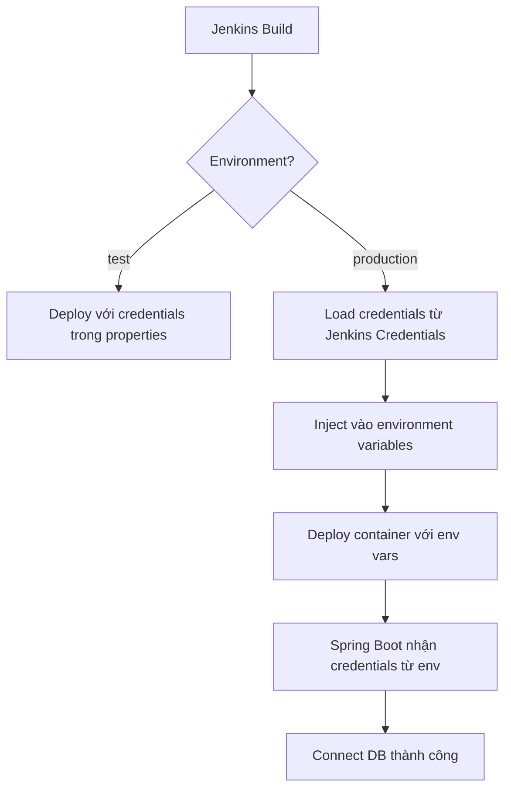

# 🔐 Security Solution - Production Credentials

## Vấn đề đã giải quyết

**Trước:**
```properties
# application-prod.properties - Push lên Git
spring.datasource.password=ENC(xxx)  ❌ Không an toàn!
```

**Sau:**
```properties
# application-prod.properties - Push lên Git OK
# Database credentials được inject từ Jenkins
```

---

## ✅ Giải pháp áp dụng

### 1. Properties Files (Git) - Chỉ chứa NON-SENSITIVE

**application-prod.properties:**
```properties
# Kafka URL - OK để public
spring.kafka.bootstrap-servers=42.112.38.103:9092

# Flyway path
spring.flyway.locations=classpath:db/migration/production

# External URLs
convert-pdf.url=http://...
```

**❌ KHÔNG có:** DB passwords, API keys, sensitive data

---

### 2. Jenkins Credentials - Lưu SENSITIVE DATA

**Setup trong Jenkins UI:**

```
Manage Jenkins → Credentials → Add:

1. db-production-credentials (Username + Password)
2. db-production-url (Secret text)
```

---

### 3. Runtime - Jenkins inject qua Environment Variables

**Jenkinsfile:**
```groovy
if (params.ENVIRONMENT == 'production') {
    withCredentials([
        usernamePassword(credentialsId: 'db-production-credentials', ...)
    ]) {
        sh """
            podman run -d \
                -e SPRING_DATASOURCE_URL=${DB_URL} \
                -e SPRING_DATASOURCE_USERNAME=${DB_USER} \
                -e SPRING_DATASOURCE_PASSWORD=${DB_PASS} \
                your-app
        """
    }
}
```

**Spring Boot nhận:**
- Environment variables có **precedence cao nhất**
- Override properties files
- Credentials không lưu trong image, chỉ trong container runtime

---

## 📋 So sánh: Test vs Production

| | Test | Production |
|---|---|---|
| **DB Credentials** | Trong `application-test.properties` | Jenkins Credentials → Env vars |
| **Security Level** | Medium (có thể accept) | High (bắt buộc) |
| **Git** | Có thể commit (encrypted) | **KHÔNG commit** |
| **Jenkins** | Deploy trực tiếp | Inject credentials trước deploy |

---

## 🎯 Workflow Deploy Production



---

## ✅ Security Checklist

Sau khi apply giải pháp:

- [x] **application-prod.properties** không chứa passwords
- [x] **Jenkinsfile** inject credentials cho production
- [x] **Jenkins Credentials** đã setup cho DB production
- [x] Test deploy production - credentials được inject đúng
- [ ] Backup Jenkins Credentials ở nơi an toàn
- [ ] Rotate credentials sau 3-6 tháng
- [ ] Audit log - monitor access credentials

---

## 📚 Files đã update

| File | Changes |
|------|---------|
| **application-prod.properties** | Xóa DB credentials, chỉ giữ public config |
| **Jenkinsfile** | Thêm logic inject credentials cho production |
| **README.md** | Thêm security notes và warning |
| **PRODUCTION-CREDENTIALS-SETUP.md** | Full guide setup credentials (MỚI) |
| **JENKINS-ENV-VARS-GUIDE.md** | Guide về env vars trong Jenkins |

---

## 🚀 Next Steps

### Bây giờ làm gì?

1. **Copy 3 properties files vào dự án:**
   ```bash
   cp spring-envs/*.properties your-project/src/main/resources/
   ```

2. **Commit và push:**
   ```bash
   git add src/main/resources/application*.properties
   git commit -m "feat: Configure environment-specific properties"
   git push origin test
   git push origin main
   ```

3. **Setup Jenkins Credentials cho production:**
   👉 Làm theo [PRODUCTION-CREDENTIALS-SETUP.md](PRODUCTION-CREDENTIALS-SETUP.md)

4. **Deploy test (không cần credentials):**
   - Jenkins → Finy → Build → Environment: test
   - ✅ Thành công ngay

5. **Deploy production (sau khi setup credentials):**
   - Jenkins → Finy → Build → Environment: production
   - ✅ Jenkins tự động inject credentials
   - ✅ Application connect DB thành công

---

## 🔍 Verify Security

### Check 1: Git không có sensitive data

```bash
# Search trong Git history
git log --all -S 'password' --source --all

# Nếu có → rewrite history (nguy hiểm)
```

### Check 2: Jenkins mask credentials trong logs

```bash
# Trong Jenkins build logs:
SPRING_DATASOURCE_PASSWORD=****  ✅ Masked
```

### Check 3: Container không lộ credentials

```bash
# Login vào container
sudo podman exec -it app sh

# Check env vars
env | grep DATASOURCE
# Chỉ thấy khi đang chạy, không lưu trong image
```

---

## 💡 Kết luận

**Trước:** Credentials trong Git → ❌ Không an toàn

**Sau:** 
- Properties files: Public config ✅
- Jenkins Credentials: Sensitive data ✅
- Runtime injection: Secure ✅

**Deployment vẫn tự động, nhưng bảo mật hơn! 🔐**
