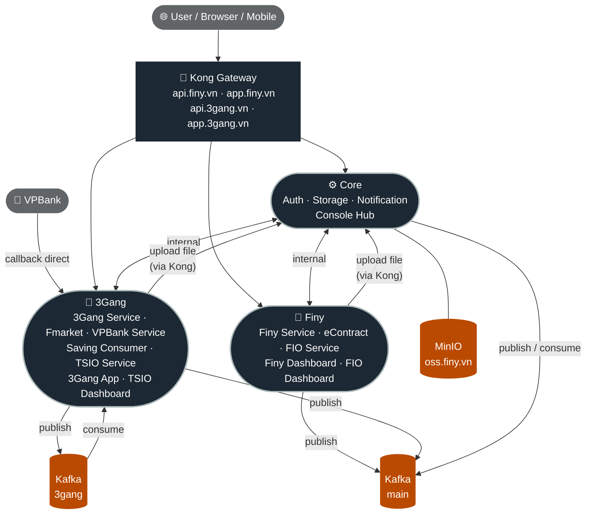
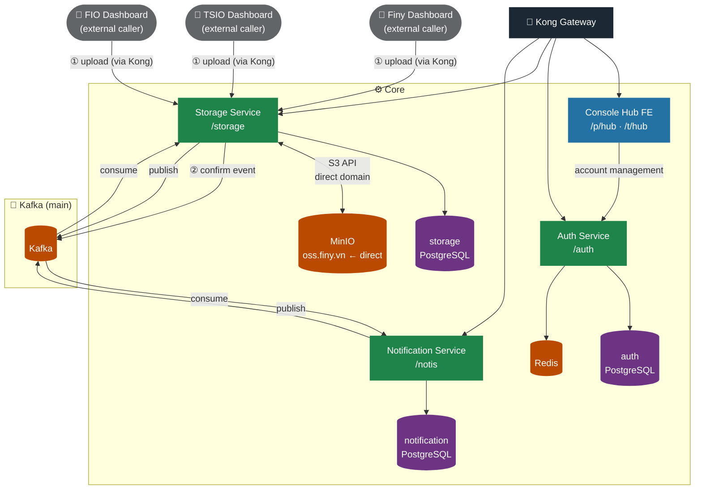
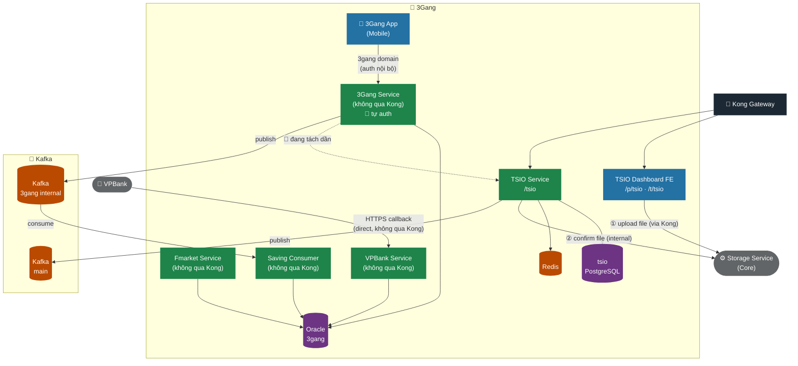
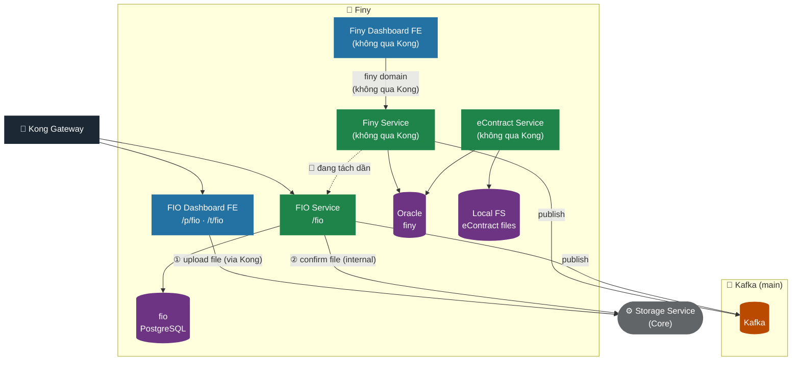

# System Architecture

---

## 1. Overview



> Chi tiết từng nhóm xem các mục bên dưới.

---

## 2. Core



| Service | Port test / prod | DB | Ghi chú |
|---|---|---|---|
| Auth Service | 8000 | PostgreSQL `auth` + Redis | JWT issuer, session validation |
| Storage Service | 8200 | PostgreSQL `storage` + MinIO | Upload từ FE, confirm từ internal |
| Notification Service | 8100 | PostgreSQL `notification` | Firebase push, consume Kafka |
| Console Hub FE | 8800 | — | Login, redirect TSIO/FIO, account mgmt qua Auth |

---

## 3. 3Gang



| Service | Port test / prod | DB | Ghi chú |
|---|---|---|---|
| 3Gang Service | — | Oracle `3gang` | Monolith legacy — **đang tách dần** sang TSIO Service |
| Fmarket Service | — | Oracle `3gang` | Dịch vụ quỹ/fund |
| VPBank Service | — | Oracle `3gang` | Nhận callback từ VPBank (direct) |
| Saving Consumer | — | Oracle `3gang` | Consume Kafka 3gang riêng |
| TSIO Service | 9007 / 8000 | PostgreSQL `tsio` + Redis | Service mới, nhận dần chức năng từ 3Gang Service |
| 3Gang App (Mobile) | — | — | Gọi 3Gang Service qua domain riêng, SSO qua Auth |
| TSIO Dashboard FE | 9008 / 8800 | — | SPA vận hành nội bộ 3Gang |

---

## 4. Finy



| Service | Port test / prod | DB | Ghi chú |
|---|---|---|---|
| Finy Service | — | Oracle `finy` | Monolith legacy — **đang tách dần** sang FIO Service |
| eContract Service | — | Oracle `finy` + Local FS | File hợp đồng lưu trực tiếp trên server |
| FIO Service | 9101 / 9010 | PostgreSQL `fio` | Service mới, nhận dần chức năng từ Finy Service |
| Finy Dashboard FE | — | — | Kết nối Finy Service qua domain riêng (không qua Kong) |
| FIO Dashboard FE | 9102 / 9011 | — | SPA vận hành nội bộ Finy (qua Kong) |

---

## 5. Key Flows

### File Upload
```
FIO/TSIO Dashboard  ──① upload──▶  Storage Service (qua Kong)
FIO/TSIO Service    ──② confirm──▶  Storage Service (internal)
Storage Service     ──publish──▶   Kafka (main)
```

### Notification
```
Any Service  ──publish──▶  Kafka (main)  ──consume──▶  Notification Service  ──▶  Firebase Push
```

### Saving Consumer (3Gang)
```
3Gang Service  ──publish──▶  Kafka (3gang)  ──consume──▶  Saving Consumer
```

### SSO / Login
```
Console Hub / TSIO Dashboard / FIO Dashboard
    ──▶  Kong  ──▶  Auth Service (/p/auth · /t/auth)

3Gang App (Mobile)
    ──▶  3Gang Service (auth nội bộ, không qua Core Auth)
```

### Migration Direction
```
Finy Service  ──🔄 tách dần──▶  FIO Service     (Oracle → PostgreSQL)
3Gang Service ──🔄 tách dần──▶  TSIO Service    (Oracle → PostgreSQL)
eContract     ──🔄 tách dần──▶  Storage Service (Local FS → MinIO)  [planned]
```

---
_Last updated: 2026-06-10_
