# System Architecture

## Diagram

```mermaid
flowchart TB
    classDef fe     fill:#2471A3,color:#fff,stroke:none
    classDef be     fill:#1E8449,color:#fff,stroke:none
    classDef db     fill:#6C3483,color:#fff,stroke:none
    classDef infra  fill:#BA4A00,color:#fff,stroke:none
    classDef gw     fill:#1C2833,color:#fff,stroke:none
    classDef ext    fill:#626567,color:#fff,stroke:none

    EXT_USER(["🌐 User / Browser"]):::ext
    EXT_VPBANK(["🏦 VPBank"]):::ext

    Kong["🔀 Kong Gateway
    api.finy.vn · app.finy.vn
    api.3gang.vn · app.3gang.vn"]:::gw

    EXT_USER --> Kong
    EXT_VPBANK -->|"HTTPS callback"| Kong

    %% ─────────────────────────────────────────
    subgraph CORE["⚙️ Core"]
        direction TB
        subgraph CORE_FE["Frontend"]
            Hub["Console Hub FE\n/p/hub · /t/hub"]:::fe
        end
        subgraph CORE_BE["Backend"]
            Auth["Auth Service\n/auth"]:::be
            Storage["Storage Service\n/storage"]:::be
            Notis["Notification Service\n/notis"]:::be
        end
        subgraph CORE_DB["Data"]
            AuthDB[("auth\nPostgreSQL")]:::db
            StorageDB[("storage\nPostgreSQL")]:::db
            NotisDB[("notification\nPostgreSQL")]:::db
            MinIO[("MinIO\noss.finy.vn ⬅ direct")]:::infra
            Redis[("Redis")]:::infra
        end
    end

    %% ─────────────────────────────────────────
    subgraph GANG["🏢 3Gang"]
        direction TB
        subgraph GANG_FE["Frontend"]
            GangApp["📱 3Gang App\n(Mobile)"]:::fe
            TsioDash["TSIO Dashboard FE\n/p/tsio · /t/tsio"]:::fe
        end
        subgraph GANG_BE["Backend"]
            GangSvc["3Gang Service"]:::be
            Fmarket["Fmarket Service"]:::be
            VPBankSvc["VPBank Service"]:::be
            SavingConsumer["Saving Consumer"]:::be
            TsioSvc["TSIO Service\n/tsio"]:::be
        end
        subgraph GANG_DB["Data"]
            OracleGang[("Oracle\n3gang")]:::db
            TsioDB[("tsio\nPostgreSQL")]:::db
        end
    end

    %% ─────────────────────────────────────────
    subgraph FINY["💙 Finy"]
        direction TB
        subgraph FINY_FE["Frontend"]
            FinyDash["Finy Dashboard FE"]:::fe
            FioDash["FIO Dashboard FE\n/p/fio · /t/fio"]:::fe
        end
        subgraph FINY_BE["Backend"]
            FinySvc["Finy Service"]:::be
            eContract["eContract Service"]:::be
            FioSvc["FIO Service\n/fio"]:::be
        end
        subgraph FINY_DB["Data"]
            OracleFiny[("Oracle\nfiny")]:::db
            FioDB[("fio\nPostgreSQL")]:::db
            LocalFS[("Local FS\neContract files")]:::db
        end
    end

    %% ─────────────────────────────────────────
    subgraph MQ["📨 Message Bus"]
        KafkaMain[("Kafka\nmain ecosystem")]:::infra
        KafkaGang[("Kafka\n3gang internal")]:::infra
    end

    %% ── Kong routing (public) ─────────────────
    Kong --> Hub
    Kong --> Auth & Storage & Notis
    Kong --> TsioDash & TsioSvc
    Kong --> FioDash & FioSvc

    %% ── External direct (không qua Kong) ─────
    EXT_VPBANK -->|"HTTPS callback\n(direct)"| VPBankSvc

    %% ── Core connections ──────────────────────
    Hub -->|"account management"| Auth
    Auth --> AuthDB & Redis
    Storage --> StorageDB & MinIO
    Notis --> NotisDB

    %% ── 3Gang connections ─────────────────────
    GangApp -->|"SSO (via Kong)"| Auth
    GangApp -->|"3gang domain\n(không qua Kong)"| GangSvc
    GangSvc & Fmarket & VPBankSvc & SavingConsumer --> OracleGang
    TsioSvc --> TsioDB & Redis

    %% ── Finy connections ──────────────────────
    FinySvc & eContract --> OracleFiny
    eContract --> LocalFS
    FioSvc --> FioDB
    FinyDash -->|"finy domain\n(không qua Kong)"| FinySvc

    %% ── Migration: tách dần khỏi monolith ───────
    FinySvc -. "🔄 đang tách dần" .-> FioSvc
    GangSvc -. "🔄 đang tách dần" .-> TsioSvc

    %% ── File upload flow ──────────────────────
    TsioDash & FioDash -->|"① upload file (via Kong)"| Storage
    TsioSvc & FioSvc  -->|"② confirm file (internal)"| Storage

    %% ── Kafka publish — main ──────────────────
    FinySvc -->|publish| KafkaMain
    TsioSvc -->|publish| KafkaMain
    FioSvc  -->|publish| KafkaMain
    Storage -->|publish| KafkaMain
    Notis   -->|publish| KafkaMain

    %% ── Kafka consume — main ──────────────────
    KafkaMain -->|consume| Storage
    KafkaMain -->|consume| Notis

    %% ── Kafka 3gang ───────────────────────────
    GangSvc -->|publish| KafkaGang
    KafkaGang -->|consume| SavingConsumer
```



---

## Service Summary

### Core

| Service | Port (test/prod) | DB | Notes |
|---|---|---|---|
| Auth Service | 8000 | PostgreSQL `auth` + Redis | JWT issuer, session validation |
| Storage Service | 8200 | PostgreSQL `storage` + MinIO | File upload từ FE, confirm từ internal services |
| Notification Service | 8100 | PostgreSQL `notification` | Firebase push, consume Kafka |
| Console Hub FE | 8800 | — | Đăng nhập, redirect sang TSIO/FIO, quản lý account qua Auth |

### 3Gang

| Service | Port (test/prod) | DB | Notes |
|---|---|---|---|
| 3Gang Service | — | Oracle `3gang` | Monolith legacy — **đang tách dần** sang TSIO Service |
| Fmarket Service | — | Oracle `3gang` | Dịch vụ quỹ/fund |
| VPBank Service | — | Oracle `3gang` | Nhận callback từ VPBank (direct, không qua Kong) |
| Saving Consumer | — | Oracle `3gang` | Consume Kafka 3gang riêng |
| TSIO Service | 9007 (test) / 8000 (prod) | PostgreSQL `tsio` + Redis | Service mới — nhận dần chức năng từ 3Gang Service |
| 3Gang App (Mobile) | — | — | App mobile người dùng cuối — gọi 3Gang Service qua domain riêng, SSO qua Auth (Kong) |
| TSIO Dashboard FE | 9008 (test) / 8800 (prod) | — | SPA vận hành 3Gang |

### Finy

| Service | Port (test/prod) | DB | Notes |
|---|---|---|---|
| Finy Service | — | Oracle `finy` | Monolith legacy — **đang tách dần** sang FIO Service |
| eContract Service | — | Oracle `finy` + Local FS | File hợp đồng lưu trực tiếp trên server (chưa dùng Storage Service) |
| FIO Service | 9101 (test) / 9010 (prod) | PostgreSQL `fio` | Service mới — nhận dần chức năng từ Finy Service |
| Finy Dashboard FE | — | — | Dashboard kết nối Finy Service qua domain riêng (không qua Kong) |
| FIO Dashboard FE | 9102 (test) / 9011 (prod) | — | SPA vận hành Finy (qua Kong) |

---

## Key Flows

### File Upload (FIO / TSIO Dashboard)
```
FIO Dashboard ──①──▶ Storage Service (upload, qua Kong)
FIO Service   ──②──▶ Storage Service (confirm dùng file, internal)
```

### Notification
```
Any service ──publish──▶ Kafka (main) ──consume──▶ Notification Service ──▶ Firebase Push
```

### Saving Consumer (3Gang internal)
```
3Gang Service ──publish──▶ Kafka (3gang) ──consume──▶ Saving Consumer
```

### SSO / Auth
```
Browser ──▶ Kong ──▶ Auth Service (/p/auth · /t/auth)
Console Hub / TSIO Dashboard / FIO Dashboard đều redirect về Auth để đăng nhập
```
```

---
_Last updated: 2026-06-10_
